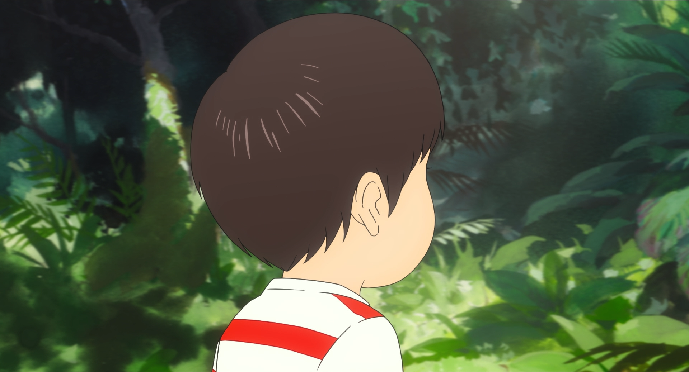

If your debanded clip had very little grain compared to parts with no
banding, you should consider using a separate function to add matched
grain so the scenes blend together easier. If there was lots of grain,
you might want to consider `adptvgrnMod`, `adaptive_grain` or
`GrainFactory3`; for less obvious grain or simply for brighter scenes
where there'd usually be very little grain, you can also use 
`grain.Add`. The topic of grainers will be further elaborated later in
[the graining section](graining).\

Here's an example from Mirai:

