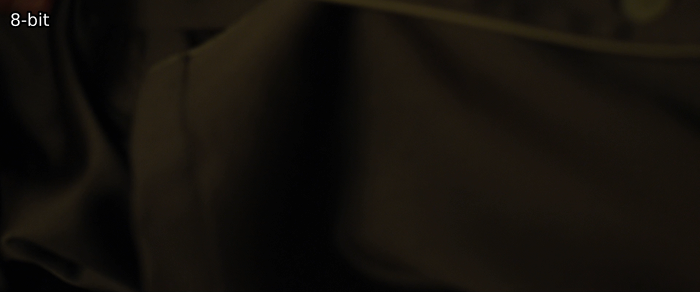

# Bit Depths: An Introduction

When you filter a frame, the results are limited to values available in your bit depth.
By default, most SDR content comes in 8-bit and HDR content in 10-bit.
In 8-bit, you're limited to values between 0 and 255.
However, as most video content is in limited range, this range becomes 16 to 235 for luma and 16 to 240 for chroma.

Let's say you want to raise every pixel whose value lies in the rang of 60 to 65 to the power of 0.88.
Rounding to three decimal places:

| Original | Raised |
|:--------:|:------:|
| 60       | 36.709 |
| 61       | 37.247 |
| 62       | 37.784 |
| 63       | 38.319 |
| 64       | 38.854 |
| 65       | 39.388 |

As we're limited to integer values between 0 and 255, these round to 37, 37, 38, 38, 39, 39.
So, while the filter doesn't lead to the same value, we round these all to the same ones.
This quickly leads to unwanted [banding](debanding.md) artifacts.
For example, raising to the power of 0.88 in 8-bit vs a higher bit depth of 32-bit:

<p align="center"> 

</p>

To mitigate this, we work in higher bit depths and later use so called dither algorithms to add some fluctuation and prevent banding.
The usual bit depths are 16-bit and 32-bit.
While 16-bit sounds worse at first, the difference isn't noticeable and 32-bit, being in float instead of integer format, is not supported by every filter.

Luckily for those not working in higher bit depth, lots of filters force higher precisions internally and dither the results back properly.
However, switching between bit depths multiple times is a waste of CPU cycles and, in extreme cases, can alter the image as well.

## Changing bit depths

To work in a higher bit depth, you can use the `depth` function from `vsutil` at the start and end of your filter chain.
This will use a high quality dither algorithm by default and takes only a few keystrokes:

```py
from vsutil import depth

src = depth(src, 16)

resize = ...

my_great_filter = ...

out = depth(my_great_filter, 8)
```

When you're working in higher bit depths, it's important to remember that some functions might expect parameter input values in 8-bit, while others expect them in the input bit depth.
If you mistakenly enter 255 assuming 8-bit in a function expecting 16-bit input, your results will be extremely different, as 255 is the higher value in 8-bit, while in 16-bit, this is roughly equivalent to 1 in 8-bit.

To convert values, you can use `scale_value` from `vsutil`, which will help handling edge cases etc.:

```py
from vsutil import scale_value

v_8bit = 128

v_16bit = scale_value(128, 8, 16)
```

This would get you `v_16bit = 32768`, the middle point of 16-bit.

This isn't quite as simple for 32-bit float, as you need to specify whether to scale offsets depending on range and whether you're scaling luma or chroma.
This is because limited range luma values are between 0 and 1, while chroma values are between -0.5 and +0.5.
Usually, you're going to be dealing with TV range, so set `scale_offsets=True`:

```py
from vsutil import scale_value

v_8bit = 128

v_32bit_luma = scale_value(128, 8, 32, scale_offsets=True)
v_32bit_chroma = scale_value(128, 8, 32, scale_offsets=True, chroma=True)
```

This gets us `v_32bit_luma = 0.5, v_32bit_chroma = 0`.

# Dither Algorithms

TODO
