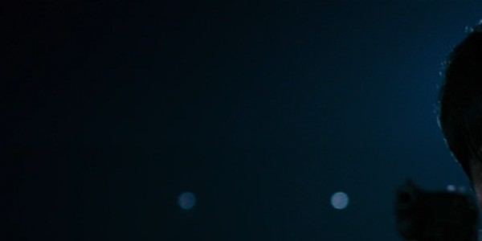

# 解带 Debanding

这是人们会遇到的最常见的问题。当码率不足(bitstarving)和糟糕的设置导致平滑的渐变变成突然的颜色变化时，通常会产生色带，这显然会让画面看起来很糟糕。这些可以通过执行类似模糊的操作并限制它们的输出来修复。

请注意，由于模糊是一个非常具有破坏性的过程，因此建议仅将其应用于视频的必要部分并使用 [蒙版(masks)](masking.md)来进一步限制更改。

VapourSynth 有三个很棒的工具可以用来修复色带：[`neo_f3kdb`](https://github.com/HomeOfAviSynthPlusEvolution/neo_f3kdb/), `fvsfunc`内置的蒙版 `gradfun3` 和 `vs-placebo`的 `placebo.Deband`。\

<p align="center">

</p>
<p align="center">
<i>使用 f3kdb 默认设置修复了色带示例</i>
</p>

## `neo_f3kdb`

```py
deband = core.neo_f3kdb.deband(src=clip, range=15, y=64, cb=64, cr=64, grainy=64, grainc=64, dynamic_grain=False, sample_mode=2)
```

这些设置对某些人来说可能不言自明，但它们的作用如下：

-   `src` 这显然是您的剪辑源。

-   `range` 这指定了用于计算某物是否有条带的像素范围。更大的范围意味着更多的像素用于计算，这意味着它需要更多的处理能力。默认值 15 通常应该没问题。提高此值可能有助于使步长较小的较大梯度看起来更平滑，而较低的值将有助于捕获较小的实例。

-   `y` 最重要的设置，因为大多数（明显的）条带发生在亮度平面上。它指定了亮度平面上的某些东西被认为是色带的差异必须有多大。你应该从低而缓慢的开始，但一定要建立这个直到条带消失。如果设置得太高，很多细节会被视为条带，因此会变得模糊。
    根据您的采样模式，值将仅以 16（mode 2）或 32（mode 1、3、4）的步长产生影响。这意味着 y=20 等价于 y=30。

-   `cb` 和 `cr`除了色度外与 `y` 都是一样的。 但是，色度平面上的色带相对不常见，因此您通常可以将其关闭。

-   `grainy` 和 `grainc` 为了防止色带再次发生并抵消平滑，通常在解带后添加颗粒。但是，由于这种假颗粒非常明显，因此建议保守一些。 或者，您可以使用自定义颗粒生成器，这将为您提供更好的输出 (有关更多信息，请参阅 [粒化部分](graining.md))。

-   `dynamic_grain` 默认情况下，由`f3kdb`添加的颗粒是静态的，这压缩得更好，因为显然变化较少，但它通常看起来与实况内容无关，因此通常建议将其设置为 `True` ，除非您正在处理动画内容。

-   `sample_mode` 在README中有说明。因为它可能具有较少的细节损失，可以考虑切换到 4。

<details>
<summary>深入讲解</summary>
TODO
</details>

## `GradFun3`

`gradfun3`是 `f3kdb` 的最受欢迎替代品。 这个函数需要更多的资源和不那么直接的参数，但在一些 `f3kdb` 处理不好的地方表现不错:

```py
import fvsfunc as fvf
deband = fvf.GradFun3(src, thr=0.35, radius=12, elast=3.0, mask=2, mode=3, ampo=1, ampn=0, pat=32, dyn=False, staticnoise=False, smode=2, thr_det=2 + round(max(thr - 0.35, 0) / 0.3), debug=False, thrc=thr, radiusc=radius, elastc=elast, planes=list(range(src.format.num_planes)), ref=src, bits=src.format.bits_per_sample) # + resizing variables
```

`fmtconv`中许多设置的值都是给位深转换或去缩放使用的, 这两者在这里都不相关。这里真正感兴趣的值是：

-   `thr` 等价于 `y`, `cb`, 和 `cr` 的作用。您可能想要提高或降低它。

-   `radius` 具有和`f3kdb`的 `range` 相同的效果。

-   `smode` 设置平滑模式。通常最好保留默认值，如果您想使用支持 CUDA 的 GPU 而不是 CPU，则设置为 5。使用 `ref` (默认为剪辑输入) 作为参考剪辑。

-   `mask` 设置遮罩强度。 0 禁用。 默认值是一个合理的值。

-   `planes` 置应处理哪些平面。

-   `debug` 允许您查看遮罩。

-   `elast` 控制去色带和剪辑源之间的混合。默认值是一个合理的值。
较高的值优先考虑去色带。

<details>
<summary>深入讲解</summary>
TODO
要更深入地解释 `thr` 和 `elast` 的作用, 请查看 <a href=https://github.com/HomeOfVapourSynthEvolution/mvsfunc/blob/master/mvsfunc.py#L1735><code>mvsfunc</code></a>的算法解释.
</details>

## `placebo.Deband`

这个 debander 对 VapourSynth 来说很新，但它非常擅长修复强条带。然而，同样地，它也容易出现不必要的细节损失，因此应该只在必要时使用，并且最好与细节/边缘蒙版结合使用。它的（当前）参数：

```py
placebo.Deband(clip clip[, int planes = 1, int iterations = 1, float threshold = 4.0, float radius = 16.0, float grain = 6.0, int dither = True, int dither_algo = 0])
```

这个功能在未来不太可能发生重大变化，因此非常值得读一读 [the README](https://github.com/Lypheo/vs-placebo/blob/master/README.md) 。

您要查看的参数：

-   `planes` 显然是要加工的平面。此处的语法不同，请查看README。简而言之，默认仅对亮度， `1 | 2 | 4` 对亮度和色度。

-   `iterations` 设置 debander 循环的频率。 不建议更改默认设置，尽管这在极端情况下很有用。

-   `threshold` 设置 debander 的强度或更改像素时的阈值。尽量不要超过 12。如果会，请以 1 为步长进行微调。

-   `radius` 与之前的功能相同。

-   `grain` 同样与 `f3kdb` 的一样, 但是颗粒更好。

<details>
<summary>深入讲解</summary>
TODO
它使用了 mpv debander，只是平均一个范围内的像素，如果差异低于阈值，则输出平均值。该算法在 <a href="https://github.com/haasn/libplacebo/blob/master/src/shaders/sampling.c#L167">中进行了解释</a>.
</details>

## 色带检测 Banding detection

如果要自动检测色带，可以使用`awsmfunc`中的 `banddtct` 。 确保正确调整值并检查完整输出。查看 [此链接](https://git.concertos.live/AHD/awsmfunc/wiki/Using-detect.py) 以获取有关如何使用它的说明。您也可以只运行 `adptvgrnMod` 或用一个高的`luma_scaling`值来运行 `adaptive_grain` 以期望颗粒可以完全覆盖它。更多信息在
[粒化部分](graining)。请注意，这两种方法都无法检测/修复所有类型的色带。 `banddtct` 找不到被颗粒覆盖的色带，而且用于修复色带的纹理仅适用于较小的实例。

# 解块 Deblocking

<p align="center">

</p>

解块相当于平滑输入源，通常是在画面顶部使用另一个蒙版。 最常用的是`havsfunc`中的 `Deblock_QED` 函数。
 主要参数是

-   `quant1`: 边缘解块的强度。 默认值为 24。您可能希望显着提高此值。

-   `quant2`: 内部解块的强度。 默认值为 26。同样，提高此值可能会有益。

<details>
<summary>深入讲解</summary>
TODO
</details>

其他常用的选项是 `deblock.Deblock`,它非常强大，几乎总是有效

<details>
<summary>深入讲解</summary>
TODO
</details>

`dfttest.DFTTest`, 相对较弱，但非常暴力，还有
`fvf.AutoDeblock`, 对于 MPEG-2 源的解块非常有用，并且可以应用于整个视频。另一种流行的方法是简单地解带，因为解块和解带非常相似。这对于 AVC 蓝光源是一个不错的选择。

<details>
<summary>深入讲解</summary>
TODO
</details>
