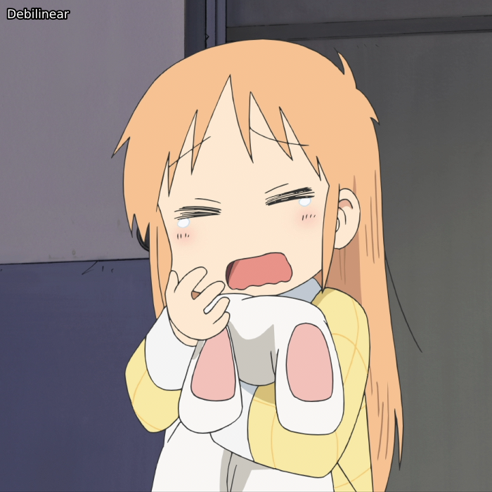
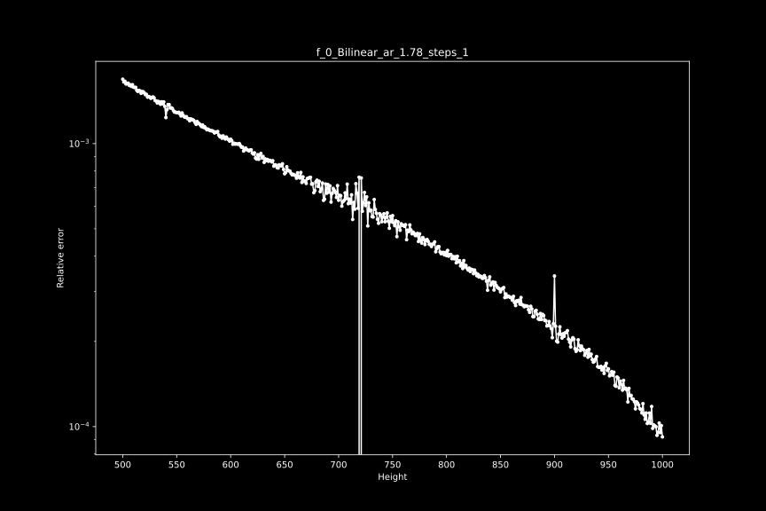
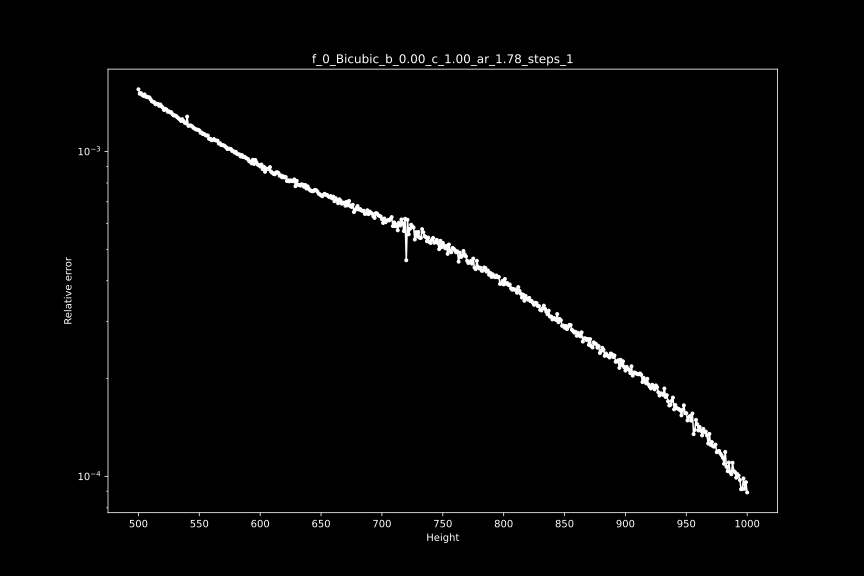
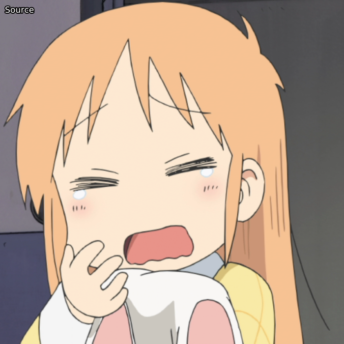
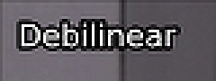

# 降尺度 Descaling

如果你读过一些关于动漫编码的文章，你可能听说过 "降尺度"这个词；这是一个通过找到原始分辨率和使用的调整内核来 "逆转 "升频的过程。
如果操作正确，这是一个近乎无损的过程，并产生比标准花键36调整大小更清晰的输出，并减少光晕伪影。
然而，如果做得不对，这只会增加已经存在的问题，如光晕、振铃等。

最常用的反比例插件是[Descale](https://github.com/Irrational-Encoding-Wizardry/vapoursynth-descale)，它最容易通过[`fvsfunc`](https://github.com/Irrational-Encoding-Wizardry/fvsfunc)调用，它对每个内核都有一个别名，例如`fvf.Debilinear`。
这支持双曲线、双线性、兰佐斯和样条曲线的升尺度。

大多数数字制作的动漫内容，特别是电视节目，都是由720p、810p、864p、900p或介于两者之间的双线性或双立方体升格而成。
虽然不是只有动漫可以做，但它在此类内容中更为普遍，所以我们将相应地关注动漫。

作为我们的例子，我们将看看Nichijou，它是一个从720p的双线升级。

为了展示降尺度的效果，让我们把它与标准的样条调整尺寸进行比较:

```py
descale = fvf.Debilinear(src, 1280, 720)
spline = src.resize.Spline36(1280, 720)
out = core.std.Interleave([descale, spline])
```
<p align="center"> 

</p>

## 原生分辨率和内核

现在，当你想降级时，你需要做的第一件事是弄清楚用什么来调整视频的大小，以及从哪个分辨率来调整大小。
这方面最流行的工具是[getnative](https://github.com/Infiziert90/getnative)，它允许你给它提供一张图片，然后它将对其进行降级、调整大小，并计算出与来源的差异，然后绘制出结果，这样你就可以找到原始分辨率。

为了使其发挥最大的作用，你要找到一个明亮的画面，并有非常少的模糊、视觉效果、纹理等。

一旦你找到了一个，你就可以按以下方式运行脚本:

```sh
python getnative.py image.png -k bilinear
```

这将在`Results`目录下输出一个图形，并猜测其分辨率。
不过，自己看一下这个图是很有必要的。
在我们的例子中，这些是正确的参数，所以我们得到以下结果。



在720p时有一个明显的下降。
我们还可以测试其他内核:

```sh
python getnative.py image.png -k bicubic -b 0 -c 1
```

然后，该图看起来如下:



如果你想测试所有可能的内核，你可以使用`--mode "all"`。

为了仔细检查，我们将输入的帧与用相同内核放大的降尺度进行比较:

```py
descale = fvf.Debilinear(src, 1280, 720)
rescale = descale.resize.Bilinear(src, src.width, src.height)
merge_chroma = rescale.std.Merge(src, [0, 1])
out = core.std.Interleave([src, merge_chroma])
```
在这里，我们将源头的色度与我们的重新缩放合并起来，因为色度的分辨率比源头的分辨率低，所以我们不能降低它的比例。
结果:

<p align="center"> 

</p>

正如你所看到的，线性图实际上是相同的，没有引入额外的光晕或混叠。

另一方面，如果我们尝试一个不正确的内核和分辨率，我们会在重新缩放的图像中看到更多的伪影:

```py
b, c = 0, 1
descale = fvf.Debicubic(src, 1440, 810, b=b, c=c)
rescale = descale.resize.Bicubic(src, src.width, src.height, filter_param_a=b, filter_param_b=c)
merge_chroma = rescale.std.Merge(src, [0, 1])
out = core.std.Interleave([src, merge_chroma])
```

<p align="center"> 

</p>

# 混合分辨率

上面关于不正确的内核和高度的例子应该很明显，不正确的降尺度是相当有破坏性的。
不幸的是，大多数可以被降级的视频都有其他分辨率的元素。
有时，一帧中的不同元素会有不同的分辨率，例如，背景是900p的，人物A是810p的，人物B是720p的。
在这样的情况下，通常做一个简单的 spline36 resize 是比较安全的。
从技术上讲，人们可以做大量的遮罩来解决这个问题，但这是一个很大的努力，而且遮罩很可能会失败。

一个更常见的会遇到混合分辨率的情况是片头和叠加，这通常是1080p的。
让我们来看看，如果我们在上面的画面中添加一些文字，并将其与 spline36 resize 进行对比，会发生什么。
为了便于比较，这些图片被放大了3倍:

<p align="center"> 

</p>

去线性调整在这里明显增加了更强的光晕伪影。

为了处理这个问题，我们可以使用`fvsfunc`中的`DescaleM`函数，它掩盖了这些元素，并通过 spline36 调整它们的大小。

```py
descale = fvf.DebilinearM(src, 1280, 720)
```

由于这些函数相对较慢，你可能要考虑事先找到这些元素，并只对这些帧应用该函数。
如果你不确定你的帧没有1080p元素，但还是坚持使用这些函数。

另外，在非常罕见的情况下，分辨率和/或内核会逐个场景变化，甚至更糟，逐个帧变化。
你可以考虑试试`lvsfunc.scale.descale`，它试图为每一帧找到理想的高度。
然而，理想的情况是，你应该手动完成这个工作。

## 4:4:4 and 4:2:0

# Upscaling and Rescaling

## Upscaling

## Rescaling

