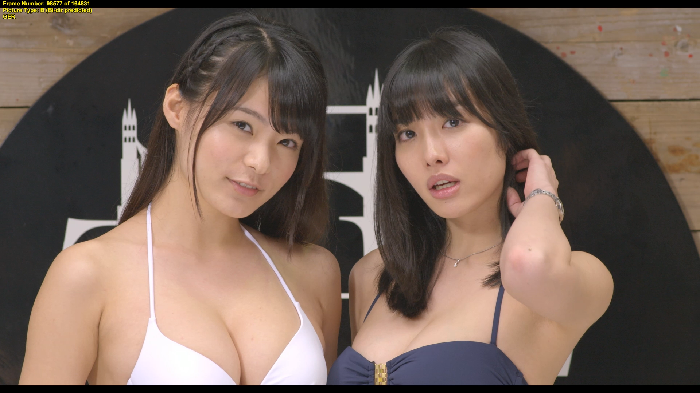
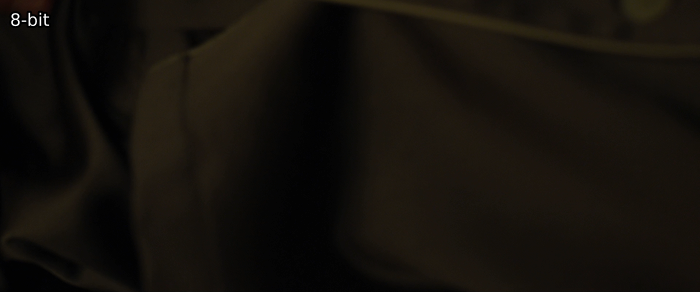
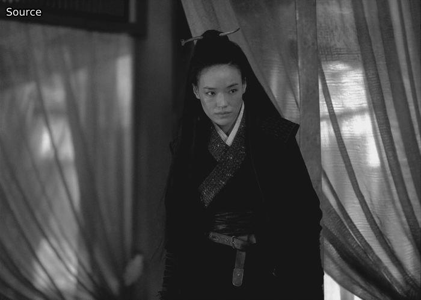
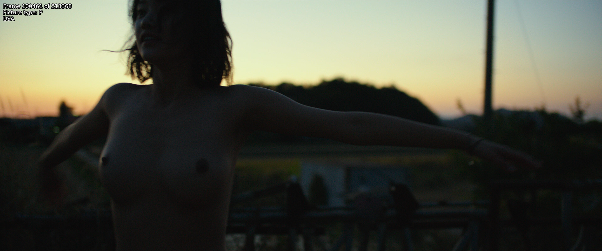
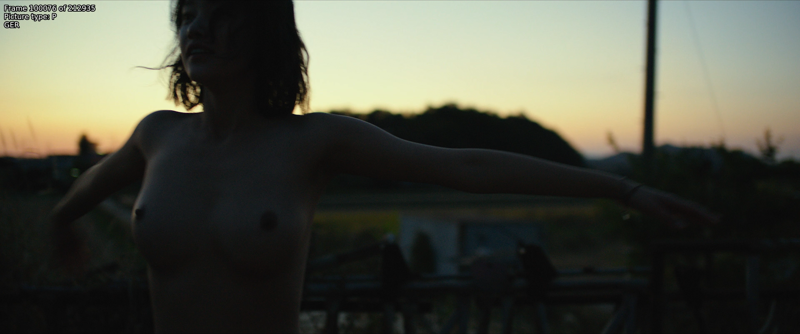
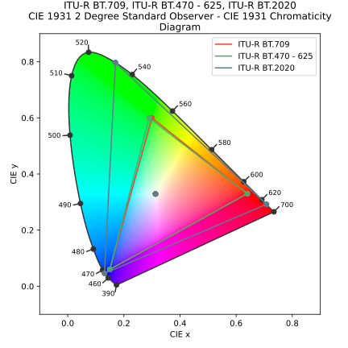
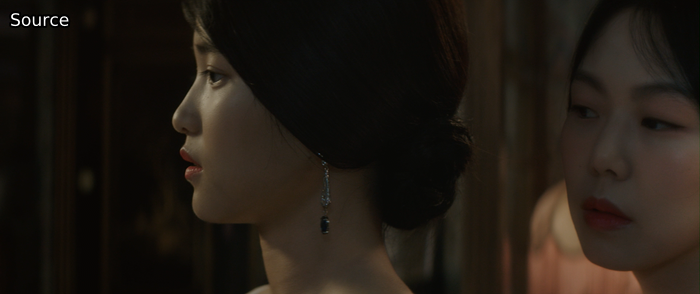
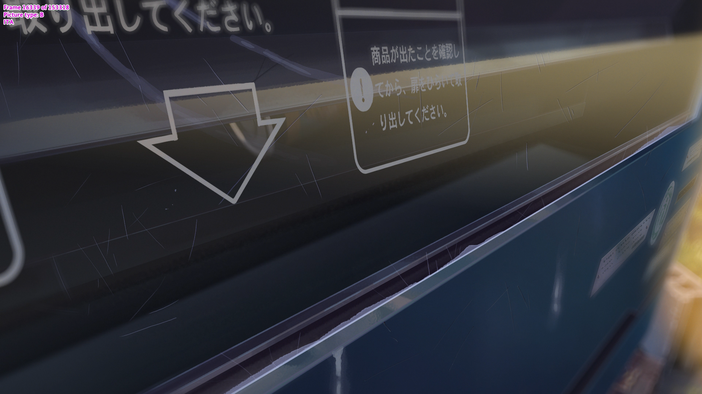

## The 0.88 gamma bug

If you have two sources of which one is noticeably brighter than the other, chances are your brighter source is suffering from what's known as the gamma bug.
If this is the case, do the following (for 16-bit) and see if it fixes the issue:

```py
out = core.std.Levels(src, gamma=0.88, min_in=4096, max_in=60160, min_out=4096, max_out=60160, planes=0)
```

<p align="center">

</p>

Do not perform this operation in low bit depth. Lower bit depths can and will lead to banding:
<p align="center">

</p>

<details>
<summary>In-depth explanation</summary>
This error seems to stem from Apple software.  <a href="https://vitrolite.wordpress.com/2010/12/31/quicktime_gamma_bug/">This blog post</a> is one of the few mentions of this blug one can find online.

The reason for this is likely that the software unnecessarily tries to convert between NTSC gamma (2.2) and PC gamma (2.5), as \\(\frac{2.2}{2.5}=0.88\\).

To undo this, every value just has to be raised to the power of 0.88, although TV range normalization has to be done:

\\[
v_\mathrm{new} = \left( \frac{v - min_\mathrm{in}}{max_\mathrm{in} - min_\mathrm{in}} \right) ^ {0.88} \times (max_\mathrm{out} - min_\mathrm{out}) + min_\mathrm{out}
\\]

For those curious on how the gamma bug source and source will differ: all values other than 16, 232, 233, 234, and 235 are different, with the largest and most common difference being 10, lasting from 63 until 125.
As an equal number of values can be hit and the operation is usually performed in high bit depth, significant detail loss is unlikely.
However, do note that, no matter the bit depth, this is a lossy process.

</details>

You can also use the `fixlvls` wrapper in `awsmfunc` to easily do this in 32-bit precision.

## Double range compression

A similar issue is double range compression.  When this occurs, luma values will range between 30 and 218.  This can easily be fixed with the following:

```py
out = src.resize.Point(range_in=0, range=1, dither_type="error_diffusion")
out = out.std.SetFrameProp(prop="_ColorRange", intval=1)
```

<p align="center">

</p>

<details>
<summary>In-depth explanation</summary>
This issue means something or someone during the encoding pipeline assumed the input to be full range despite it already being in limited range.  As the end result usually has to be limited range, this perceived issue is "fixed".

One can also do the exact same in <code>std.Levels</code> actually.  The following math is applied for changing range:

\\[
v_\mathrm{new} = \left( \frac{v - min_\mathrm{in}}{max_\mathrm{in} - min_\mathrm{in}} \right) \times (max_\mathrm{out} - min_\mathrm{out}) + min_\mathrm{out}
\\]

For range compression, the following values are used:
\\[
min_\mathrm{in} = 0 \qquad max_\mathrm{in} = 255 \qquad min_\mathrm{out} = 16 \qquad max_\mathrm{out} = 235
\\]

As the zlib resizers use 32-bit precision to perform this internally, it's easiest to just use those.  However, these will change the file's <code>_ColorRange</code> property, hence the need for <code>std.SetFrameProp</code>. 

</details>

## Other incorrect levels

A closely related issue is otherwise incorrect levels.  To fix this, one ideally uses a reference source with correct levels, finds the equivalent values to 16 and 235, then adjusts from there (in 8-bit for clarity, do this in higher bit depths):

```py
out = src.std.Levels(min_in=x, min_out=16, max_in=y, max_out=235)
```

However, this usually won't be possible.  Instead, one can do the following math to figure out the correct adjustment values:

\\[
v = \frac{v_\mathrm{new} + min_\mathrm{out}}{max_\mathrm{out} - min_\mathrm{out}} \times (max_\mathrm{in} - min_\mathrm{in}) + min_\mathrm{in}
\\]

Whereby one can just choose any low value from the to-be-adjusted source, set that as \\(min_\mathrm{in}\\), choose the value for that same pixel in the reference source as \\(min_\mathrm{out}\\).  One does the same for high values and maximums.  Then, one calculates this for 16 and 235 (again, preferably in high bit depths - 4096 and 60160 for 16-bit, 0 and 1 in 32-bit float etc.) and the output values will be our \\(x\\) and \\(y\\) in the VapourSynth code above.

To illustrate this, let's use the German and American Blu-rays of Burning (2018).  The USA Blu-ray has correct levels, while GER has incorrect ones:

<p align="center">

</p>

A high value in GER here would be 208, while the same pixel is 216 in USA.  For lows, one can find 25 and 28.  With these, we get 19.5 and 225.9.  Doing these for a couple more pixels and different frames, then averaging the values we get 19 and 224.  We adjust using these and a significantly closer image[^1]:

<p align="center">

</p>

<details>
<summary>In-depth explanation</summary>
Those who have read the previous explanations should recognize this function, as it is the inverse of the function used for level adjustment.  We simply reverse it, set our desired values as \(v_\mathrm{new}\) and calculate.
</details>

## Improper color matrix

If you have a source with an improper color matrix, you can fix this
with the following:

```py
out = core.resize.Point(src, matrix_in_s='470bg', matrix_s='709')
```

The `’470bg’` is what's also known as 601. To know if you should be
doing this, you'll need some reference sources, preferably not web
sources. Technically, you can identify bad colors and realize that it's
necessary to change the matrix, but one should be extremely certain in such cases.

<p align="center">

</p>

<details>
<summary>In-depth explanation</summary>
Color matrices define how conversion between YCbCr and RGB takes place.  As RGB naturally doesn't have any subsampling, the clip is first converted from 4:2:0 to 4:4:4, then from YCbCr to RGB, then the process is reverted.  During the YCbCr to RGB conversion, we assume Rec.601 matrix coefficients, while during the conversion back, we specify Rec.709.

The reason why it's difficult to know whether the incorrect standard was assumed is because the two cover a similar range of CIE 1931.  The chromaticity diagrams should make this obvious (Rec.2020 included as a reference):

<p align="center">

</p>

</details>

## Rounding error

A slight green tint may be indicative of a rounding error having occured.
To fix this, we need to add a half step in a higher bit depth than the source's:

```py
high_depth = vsutil.depth(src, 16)
half_step = high_depth.std.Expr("x 128 +")
out = vsutil.depth(half_step, 8)
```

<p align="center">

</p>

Alternatively, one can use [`lvsfunc.misc.fix_cr_tint`](https://github.com/Irrational-Encoding-Wizardry/lvsfunc) instead.
Its defaults are equivalent to the above.

<details>
<summary>In-depth explanation</summary>
When the studio went from their 10-bit master to 8-bit, their software may have always rounded down (e.g. 1.9 would be rounded to 1).
Our way of solving this simply adds an 8-bit half step, as \(0.5 \times 2 ^ {16 - 8} = 128\).
</details>

## Detinting

Please note that you should only resort to this method if all others fail.

If you've got a better source with a tint and a worse source without a
tint, and you'd like to remove it, you can do so via [`timecube`](https://github.com/sekrit-twc/timecube) and
[DrDre's Color Matching Tool](https://valeyard.net/2017/03/drdres-color-matching-tool-v1-2.php)[^2]. First, add two reference screenshots
to the tool, export the LUT, save it, and add it via something like:

```py
clip = core.resize.Point(src, matrix_in_s="709", format=vs.RGBS)
detint = core.timecube.Cube(clip, "LUT.cube")
out = core.resize.Point(detint, matrix=1, format=vs.YUV420P16, dither_type="error_diffusion")
```

<p align="center">

</p>

[^1]: For simplicity's sake, chroma planes weren't touched here.  These require far more work than luma planes, as it's harder to find very vibrant colors, especially with screenshots like this.

[^2]: This program is sadly closed source.  I don't know of any alternatives for this.
