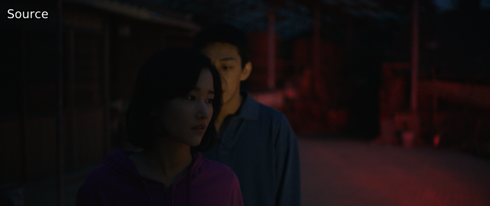

If you've got a better source with a tint and a worse source without a
tint, and you'd like to remove it, you can do so via [`timecube`](https://github.com/sekrit-twc/timecube) and
[DrDre's Color Matching Tool](https://valeyard.net/2017/03/drdres-color-matching-tool-v1-2.php). First, add two reference screenshots
to the tool, export the LUT, save it, and add it via something like:

```py
clip = core.resize.Point(src, matrix_in_s="709", format=vs.RGBS)
detint = core.timecube.Cube(clip, "LUT.cube")
out = core.resize.Point(detint, matrix=1, format=vs.YUV420P16, dither_type="error_diffusion")
```

<p align="center">

</p>

Similarly, if you have what's known as a gamma bug, where the video's gamma is raised by 1.134, just do the following (for 16-bit):

```py
out = core.std.Levels(src, gamma=0.88, min_in=4096, max_in=60160, min_out=4096, max_out=60160, planes=0)
```

<p align="center">

</p>

0.88 is usually going to be the required value, but it's not unheard of
to have to apply different gamma values. This is necessary if blacks
have a luma value of 218 instead of 235. Do not perform this operation
in low bit depth. The reasoning for this can be seen in figure
[20](#fig:flvls){reference-type="ref" reference="fig:flvls"}. If the
chroma planes are also affected, you'll have to deal with them
separately:

### TODO: This is bullshit from what I know.  The gamma bug should only occur for luma.

```py
out = core.std.Levels(src, gamma=0.88, min_in=4096, max_in=61440, min_out=4096, max_out=61440, planes=[1, 2])
```

### TODO: Add double range compression.

You can also use the `fixlvls` wrapper in `awsmfunc` to do all these
operations.

If you have a source with an improper color matrix, you can fix this
with the following:

```py
out = core.resize.Point(src, matrix_in_s='470bg', matrix_s='709')
```

The `’470bg’` is what's also known as 601. To know if you should be
doing this, you'll need some reference sources, preferably not web
sources. Technically, you can identify bad colors and realize that it's
necessary to change the matrix.

<p align="center">

</p>
