<p align="center">
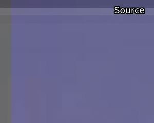
</p>
<p align="center">
<i>来自 A Silent Voice (2016)的前奏的脏线。鼠标移上去: 用ContinuityFixer和FillBorders修复。</i>
</p>

你可能会遇到的一个更常见的问题是 "脏线"，这通常是在视频的边界上发现的，其中一排或一列的像素表现出与周围环境不一致的亮度值。通常情况下，这是由于不当的downscaling，例如在添加边框后downscaling。脏线也可能发生，因为压缩者没有考虑到他们在使用4:2:2色度子采样时（意味着他们的高度不必是mod2），消费者的视频将是4:2:0，导致额外的黑行，如果主片段没有正确放置，你就无法在裁剪时摆脱。另一种形式的脏线是在黑条上出现色度平面时表现出来的。通常情况下，这些应该被裁剪掉。然而，相反的情况也可能发生，即具有合法的 luma 信息的平面缺乏色度信息。

重要的是要记住，有时你的来源会有假行（通常被称为 "死"行），也就是没有合法信息的行。这些通常只是镜像下一行/一列。不要麻烦地修复这些，只需裁剪它们。一个例子:

<p align="center">
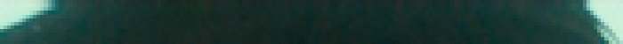
</p>

同样，当你试图修复脏线时，你应该彻底检查你的修复没有引起不必要的问题，如涂抹（常见于过度热心的ContinuityFixer值）或闪烁（特别是在片头，在大多数情况下，建议从你的修复中省略片头卷）。如果你不能找出适当的修复方法，完全可以裁剪掉脏线或不修复。糟糕的修复比没有修复更糟糕

这里有五种常用的修复脏线的方法:

## `rektlvls`\
来自[`rekt`](https://github.com/Ututu/rekt)。这基本上是AviSynth的 `FixBrightnessProtect3` 和 `FixBrightness` 的合二为一，尽管与  `FixBrightness` 不同，不是对整个画面进行处理。它的数值很直接。提高调整值是为了变亮，降低是为了变暗。将`prot_val`设置为`None`，它的功能就像`FixBrightness`，意味着调整值需要改变。
```py
from rekt import rektlvls
fix = rektlvls(src, rownum=None, rowval=None, colnum=None, colval=None, prot_val=[16, 235])
```

如果你想一次处理多行，你可以输入一个列表 (例如 `rownum=[0, 1, 2]`).\

为了说明这一点，让我们看看《寄生虫》（2017）的黑白蓝光中的脏线。寄生虫（2019）的底层行的黑白蓝光:

<p align="center">
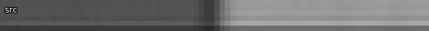
</p>

在这个例子中，最下面的四行有交替的亮度 与下两行的偏移量。所以，我们可以用`rektlvls`来提高 提高第一行和第三行的luma，然后再降低第二行和第四行的luma。在第二和第四行中降低。

```py
fix = rektlvls(src, rownum=[803, 802, 801, 800], rowval=[27, -10, 3, -3])
```

在这种情况下，我们处于`FixBrightnessProtect3`模式。我们在这里没有利用`prot_val`的优势，但人们通常会使用这种模式，因为总有机会帮助我们。结果是:
<p align="center">
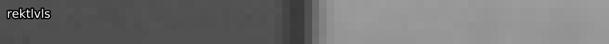
</p>
<details>
<summary>深入解释</summary>
In <code>FixBrightness</code> mode, this will perform an adjustment with
<a href="www.vapoursynth.com/doc/functions/video/levels.html"><code>std.Levels</code></a> on the desired row. This means that, in 8-bit,
every possible value \(v\) is mapped to a new value according to the
following function: 
$$\begin{aligned}
&\forall v \leq 255, v\in\mathbb{N}: \\
&\max\left[\min\left(\frac{\max(\min(v, \texttt{max_in}) - \texttt{min_in}, 0)}{(\texttt{max_in} - \texttt{min_in})}\times (\texttt{max_out} - \texttt{min_out}) + \texttt{min_out}, 255\right), 0\right] + 0.5
\end{aligned}$$
For positive <code>adj_val</code>,
\(\texttt{max_in}=235 - \texttt{adj_val}\). For negative ones,
\(\texttt{max_out}=235 + \texttt{adj_val}\). The rest of the values
stay at 16 or 235 depending on whether they are maximums or
minimums.

<code>FixBrightnessProtect3</code> mode takes this a bit further, performing
(almost) the same adjustment for values between the first
\\(\texttt{prot_val} + 10\\) and the second \\(\texttt{prot_val} - 10\\),
where it scales linearly. Its adjustment value does not work the
same, as it adjusts by \\(\texttt{adj_val} \times 2.19\\).  In 8-bit:

Line brightening:
$$\begin{aligned}
&\texttt{if }v - 16 <= 0 \\\\
&\qquad 16 / \\\\
&\qquad \texttt{if } 235 - \texttt{adj_val} \times 2.19 - 16 <= 0 \\\\
&\qquad \qquad 0.01 \\\\
&\qquad \texttt{else} \\\\
&\qquad \qquad 235 - \texttt{adj_val} \times 2.19 - 16 \\\\
&\qquad \times 219 \\\\
&\texttt{else} \\\\
&\qquad (v - 16) / \\\\
&\qquad \texttt{if }235 - \texttt{adj_val} \times 2.19 - 16 <= 0 \\\\
&\qquad \qquad 0.01 \\\\
&\qquad \texttt{else} \\\\
&\qquad \qquad 235 - \texttt{adj_val} \times 2.19 - 16 \\\\
&\qquad \times 219 + 16
\end{aligned}$$

Line darkening:
$$\begin{aligned}
&\texttt{if }v - 16 <= 0 \\\\
&\qquad\frac{16}{219} \times (235 + \texttt{adj_val} \times 2.19 - 16) \\\\
&\texttt{else} \\\\
&\qquad\frac{v - 16}{219} \times (235 + \texttt{adj_val} \times 2.19 - 16) + 16 \\\\
\end{aligned}$$

All of this, which we give the variable \\(a\\), is then protected by (for simplicity's sake, only doing dual <code>prot_val</code>, noted by \\(p_1\\) and \\(p_2\\)):
$$\begin{aligned}
& a \times \min \left[ \max \left( \frac{v - p_1}{10}, 0 \right), 1 \right] \\\\
& + v \times \min \left[ \max \left( \frac{v - (p_1 - 10)}{10}, 0 \right), 1 \right] \times \min \left[ \max \left( \frac{p_0 - v}{-10}, 0\right), 1 \right] \\\\
& + v \times \max \left[ \min \left( \frac{p_0 + 10 - v}{10}, 0\right), 1\right] 
\end{aligned}$$
</details>

## `bbmod`\
来自`awsmfunc`。 这是原BalanceBorders函数的一个模子。虽然它不能像`rektlvls`那样保留原始数据，但在高`blur`和`thresh`值的情况下，它可以产生很好的结果，而且很容易用于多行，特别是具有不同亮度的行，`rektlvls`就不再有用。如果它不能产生像样的结果，可以改变这些值，但是你设置得越低，这个函数的破坏性就越大。它也比`havsfunc`和`sgvsfunc`中的版本快得多，因为只有必要的像素被处理。\

```py
import awsmfunc as awf
bb = awf.bbmod(src=clip, left=0, right=0, top=0, bottom=0, thresh=[128, 128, 128], blur=[20, 20, 20], planes=[0, 1, 2], scale_thresh=False, cpass2=False)
```

`thresh`和`blur`的数组同样是y、u和v值。
建议首先尝试 `blur=999`，然后降低它和 `thresh`，直到你得到合适的值。
`thresh` 指定了结果与输入值的差异程度。这意味着这个值越低越好。`blur`是过滤器的强度，数值越低越强，数值越大越不积极。如果你设置`blur=1`，你基本上是在复制行。如果你在色度方面有问题，你可以尝试激活`cpass2`，但要注意这需要设置一个非常低的`thresh`，因为这大大改变了色度处理，使其相当激进。

对于我们的例子，我已经创建了假的脏线，我们将修复它:

<p align="center">
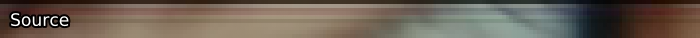
</p>

为了解决这个问题，我们可以应用`bbmod`，用低模糊度和高阈值。
这意味着像素值会有很大的变化:

```py
fix = awf.bbmod(src, top=6, thresh=90, blur=20)
```
<p align="center">
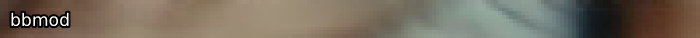
</p>

我们的输出已经非常接近于我们假设的源文件的样子了。与`rektlvls`不同，这个函数使用起来相当快，所以懒人（即每个人）可以在调整大小之前用它来修复脏线，因为在调整大小之后，差别不会很明显。

虽然你可以根据需要在许多行/列上使用`rektlvls`，但对`bbmod`来说却不是如此。 除非你之后调整大小，否则对于低的 `blur` 值(\\(\approx 20\\))，你应该只在两行/像素上使用`bbmod`，对于高的 `blur` 值，你应该使用三行/像素。如果你是之后调整大小，你可以根据以下情况改变最大值:
\\[
max_\mathrm{resize} = max \times \frac{resolution_\mathrm{source}}{resolution_\mathrm{resized}}
\\]
<details>
<summary>深入解释</summary>
<code>bbmod</code> works by blurring the desired rows, input rows, and
reference rows within the image using a blurred bicubic kernel,
whereby the blur amount determines the resolution scaled to accord
to \(\mathtt{\frac{width}{blur}}\). The output is compared using
expressions and finally merged according to the threshold specified.

The function re-runs one function for the top border for each side by flipping and transposing.  As such, this explanation will only cover fixing the top.

First, we double the resolution without any blurring (\\(w\\) and \\(h\\) are input clip's width and height):
\\[
clip_2 = \texttt{resize.Point}(clip, w\times 2, h\times 2)
\\]
<p align="center">
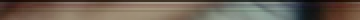
</p>

Now, the reference is created by cropping off double the to-be-fixed number of rows.  We set the height to 2 and then match the size to the double res clip:
\\[\begin{align}
clip &= \texttt{CropAbs}(clip_2, \texttt{width}=w \times 2, \texttt{height}=2, \texttt{left}=0, \texttt{top}=top \times 2) \\\\
clip &= \texttt{resize.Point}(clip, w \times 2, h \times 2)
\end{align}\\]
<p align="center">
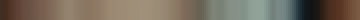
</p>

Before the next step, we determine the \\(blurwidth\\):
\\[
blurwidth = \max \left( 8, \texttt{floor}\left(\frac{w}{blur}\right)\right)
\\]
In our example, we get 8.

Now, we use a blurred bicubic resize to go down to \\(blurwidth \times 2\\) and back up:
\\[\begin{align}
referenceBlur &= \texttt{resize.Bicubic}(clip, blurwidth \times 2, top \times 2, \texttt{b}=1, \texttt{c}=0) \\\\
referenceBlur &= \texttt{resize.Bicubic}(referenceBlur, w \times 2, top \times 2, \texttt{b}=1, \texttt{c}=0)
\end{align}\\]
<p align="center">
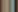
</p>
<p align="center">
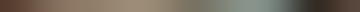
</p>

Then, crop the doubled input to have height of \\(top \times 2\\):
\\[
original = \texttt{CropAbs}(clip_2, \texttt{width}=w \times 2, \texttt{height}=top \times 2)
\\]
<p align="center">
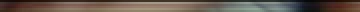
</p>

Prepare the original clip using the same bicubic resize downwards:
\\[
clip = \texttt{resize.Bicubic}(original, blurwidth \times 2, top \times 2, \texttt{b}=1, \texttt{c}=0)
\\]
<p align="center">
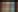
</p>

Our prepared original clip is now also scaled back down:
\\[
originalBlur = \texttt{resize.Bicubic}(clip, w \times 2, top \times 2, \texttt{b}=1, \texttt{c}=0)
\\]
<p align="center">
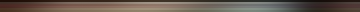
</p>

Now that all our clips have been downscaled and scaled back up, which is the blurring process that approximates what the actual value of the rows should be, we can compare them and choose how much of what we want to use.  First, we perform the following expression (\\(x\\) is \\(original\\), \\(y\\) is \\(originalBlur\\), and \\(z\\) is \\(referenceBlur\\)):
\\[
\max \left[ \min \left( \frac{z - 16}{y - 16}, 8 \right), 0.4 \right] \times (x + 16) + 16
\\]
The input here is:
\\[
balancedLuma = \texttt{Expr}(\texttt{clips}=[original, originalBlur, referenceBlur], \texttt{"z 16 - y 16 - / 8 min 0.4 max x 16 - * 16 +"})
\\]
<p align="center">
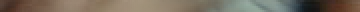
</p>

What did we do here?  In cases where the original blur is low and supersampled reference's blur is high, we did:
\\[
8 \times (original + 16) + 16
\\]
This brightens the clip significantly.  Else, if the original clip's blur is high and supersampled reference is low, we darken:
\\[
0.4 \times (original + 16) + 16
\\]
In normal cases, we combine all our clips:
\\[
(original + 16) \times \frac{originalBlur - 16}{referenceBlur - 16} + 16
\\]

We add 128 so we can merge according to the difference between this and our input clip:
\\[
difference = \texttt{MakeDiff}(balancedLuma, original)
\\]

Now, we compare to make sure the difference doesn't exceed \\(thresh\\):
\\[\begin{align}
difference &= \texttt{Expr}(difference, "x thresh > thresh x ?") \\\\
difference &= \texttt{Expr}(difference, "x thresh < thresh x ?")
\end{align}\\]

These expressions do the following:
\\[\begin{align}
&\texttt{if }difference >/< thresh:\\\\
&\qquad    thresh\\\\
&\texttt{else}:\\\\
&\qquad    difference
\end{align}\\]

This is then resized back to the input size and merged using <code>MergeDiff</code> back into the original and the rows are stacked onto the input.  The output resized to the same res as the other images:

<p align="center">
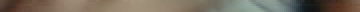
</p>
</details>

## `FillBorders`\
来自[`fb`](https://github.com/dubhater/vapoursynth-fillborders)。 这个函数几乎就是复制下一列/行的内容。
虽然这听起来很傻，但当降频导致更多的行在底部而不是顶部，并且由于YUV420的mod2高度，我们必须填补一个行时，它就会非常有用。

```py
fill = core.fb.FillBorders(src=clip, left=0, right=0, bottom=0, top=0, mode="fixborders")
```

这个函数的一个非常有趣的用途是类似于只对色度平面应用`ContinuityFixer`，它可以用于灰色边界或无论应用什么luma修复都与周围环境不匹配的边界。这可以用下面的脚本来完成:

```py
fill = core.fb.FillBorders(src=clip, left=0, right=0, bottom=0, top=0, mode="fixborders")
merge = core.std.Merge(clipa=clip, clipb=fill, weight=[0,1])
```

你也可以分割平面，单独处理色度平面，尽管这样做只是稍微快一点。在`awsmfunc`中重新封装了`FillBorders`，它允许你为`fb`指定每个平面的值。

注意，你应该只用`FillBorders`来填充单列/行。 如果你有更多的黑线，请裁剪它们  如果视频中存在需要不同裁剪的帧，不要把这些填满。 本章末尾会有更多这方面的内容。

为了说明需要`FillBorders`的片源可能是什么样子，让我们再次看看Parasite (2019)的SDR UHD，它需要不均匀地裁剪277。然而，由于色度子采样，我们不能裁剪，所以我们需要填补一行。为了说明这一点，我们将只看最上面的几行。根据色度子采样进行裁剪，我们可以得到:

```py
crp = src.std.Crop(top=276)
```

<p align="center">
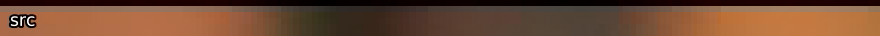
</p>

很明显，我们想去掉顶部的黑线，所以让我们对它使用`FillBorders`:

```py
fil = crp.fb.FillBorders(top=1, mode="fillmargins")
```
<p align="center">
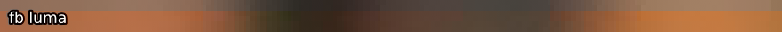
</p>

这看起来已经比较好了，但是橙色的色调看起来被洗掉了。
这是因为`FillBorders`在**两个**的luma被固定的情况下只能填充一个chroma。所以，我们也需要填充色度。为了使这个更容易写，让我们使用`awsmfunc`内封装的。

```py
fil = awf.fb(crp, top=1)
```
<p align="center">
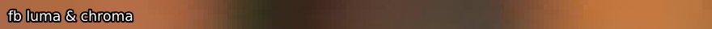
</p>

我们的来源现在已经固定了。有些人可能想调整色度的大小，以保持原来的长宽比，对色度进行有损重采样，但这是否是一种方式，一般没有共识。如果你想走这条路:

```py
top = 1
bot = 1
new_height = crp.height - (top + bot)
fil = awf.fb(crp, top=top, bottom=bot)
out = fil.resize.Spline36(crp.width, new_height, src_height=new_height, src_top=top) 
```
<details>
<summary>深入解释</summary>
<code>FillBorders</code> has four modes, although we only really care about mirror, fillmargins, and fixborders.
The mirror mode literally just mirrors the previous pixels.  Contrary to the third mode, repeat, it doesn't just mirror the final row, but the rows after that for fills greater than 1.  This means that, if you only fill one row, these modes are equivalent.  Afterwards, the difference becomes obvious.

In fillmargins mode, it works a bit like a convolution, whereby for rows it does a [2, 3, 2] of the next row's pixels, meaning it takes 2 of the left pixel, 3 of the middle, and 2 of the right, then averages.  For borders, it works slightly differently: the leftmost pixel is just a mirror of the next pixel, while the eight rightmost pixels are also mirrors of the next pixel.  Nothing else happens here.

The fixborders mode is a modified fillmargins that works the same for rows and columns.  It compares fills with emphasis on the left, middle, and right with the next row to decide which one to use.
</details>

## `ContinuityFixer`\
来自[`cf`](https://gitlab.com/Ututu/VS-ContinuityFixer)。 `ContinuityFixer`的工作方式是将指定的行/列与周围`range`指定的行/列数量进行比较，通过最小二乘法回归找到新的数值。结果与`bbmod`相似，但它创建的数据完全是假的，所以最好使用`rektlvls`或`bbmod`来代替高模糊度。它的设置看起来如下:

```py
fix = core.cf.ContinuityFixer(src=clip, left=[0, 0, 0], right=[0, 0, 0], top=[0, 0, 0], bottom=[0, 0, 0], radius=1920)
```

这是假设你使用的是1080p的素材，因为`radius`的值被设置为源的分辨率所定义的最长的一组。我推荐一个更低的值，但不要低于3，因为在这一点上，你可能是在复制像素（见下面的`FillBorders`）。可能会让大多数新手感到困惑的是我所输入的行/列固定值的数组。这些值表示要应用于三个平面的值。通常情况下，脏线只发生在luma平面上，所以你可以把其他两个平面的值保持为0。请注意，数组不是必须的，所以你也可以直接输入你想要修复的行/列的数量，所有平面都会被处理。

由于`ContinuityFixer`不太可能保持原始数据，建议优先使用`bbmod`而不是它。

让我们再看一下`bbmod`的例子，并应用`ContinuityFixer`:

```py
fix = src.cf.ContinuityFixer(top=[6, 6, 6], radius=10)
```
<p align="center">
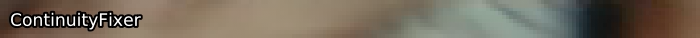
</p>

让我们把这个和bbmod的修复进行比较（记得鼠标移到上面去比较）:

<p align="center">

</p>
结果在这里 <code>ContinuityFixer</code> 稍微好一点。
这种情况很少发生，因为`ContinuityFixer`往往比`bbmod`更具破坏性。

就像`bbmod`一样，`ContinuityFixer`不应该被用于超过两行/列。 同样，如果你要调整大小，你可以相应改变这个最大值:
\\[
max_\mathrm{resize} = max \times \frac{resolution_\mathrm{source}}{resolution_\mathrm{resized}}
\\]   
<details>
<summary>深入解释</summary>
<code>ContinuityFixer</code> works by calculating the <a href=https://en.wikipedia.org/wiki/Least_squares>least squares
regression</a> of the pixels within the radius. As such, it creates
entirely fake data based on the image's likely edges.  No special explanation here.
</details>

## `ReferenceFixer`\
来自[`edgefixer`](https://github.com/sekrit-twc/EdgeFixer)。 这需要原始版本的`edgefixer`（`cf`只是它的一个旧的移植版本，但它更好用，而且处理过程没有改变）。我从来没有发现它有什么用处，但在理论上，它是相当整洁的。它与参考素材进行比较，以调整其边缘固定，就像在`ContinuityFixer`中一样。

```py
fix = core.edgefixer.Reference(src, ref, left=0, right=0, top=0, bottom=0, radius = 1920)
```

## 笔记

### 太多的行/列

有一点不应该被忽视的是，将这些修正（除了`rektlvls`）应用于太多的行/列，可能会导致这些行/列在最终结果上看起来模糊不清。正因为如此，建议尽可能使用`rektlvls`，或者只在必要的行上仔细应用轻量级的修正。如果失败了，最好在使用 "ContinuityFixer "之前尝试一下`bbmod`。

### 调整大小

值得注意的是，在调整大小之前，你应该*始终*修复脏线，因为不这样做会引入更多的脏线。然而，重要的是要注意，如果你在一个边缘有一条黑线，你可以使用`FillBorders`，你应该用你的调整器把它删除。

例如，要将一个顶部有一条填充线的剪辑从\\(1920\times1080\\)到\\(1280\times536\\):

```py
top_crop = 138
bot_crop = 138
top_fill = 1
bot_fill = 0
src_height = src.height - (top_crop + bot_crop) - (top_fill + bot_fill)
crop = core.std.Crop(src, top=top_crop, bottom=bot_crop)
fix = core.fb.FillBorders(crop, top=top_fill, bottom=bot_fill, mode="fillmargins")
resize = core.resize.Spline36(1280, 536, src_top=top_fill, src_height=src_height)
```

### 对角线的边框

如果你要处理对角线的边框，这里正确的做法是屏蔽边框区域，用`FillBorders`调用来合并源。这方面的一个例子 (来自 你的名字 (2016)):

<p align="center">
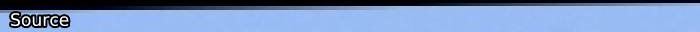
</p>

修正在填充边缘模式下与未填充的比较，并调整对比度以获得清晰的效果:
<p align="center">
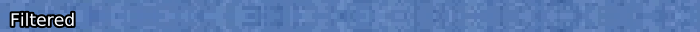
</p>

使用的代码（注意，这是除着色后的结果）:
```py
mask = core.std.ShufflePlanes(src, 0, vs.GRAY).std.Binarize(43500)
cf = core.fb.FillBorders(src, top=6, mode="mirror").std.MaskedMerge(src, mask)
```

### 寻找脏线

脏线可能相当难以发现。如果你在检查随机框架的边框时没有立即发现任何问题，那么你很可能会没事。如果你知道有一些框架的每一面都有小的黑色边框，你可以使用类似[以下脚本](https://gitlab.com/snippets/1834089)的东西:

```py
def black_detect(clip, thresh=None):
    if thresh:
        clip = core.std.ShufflePlanes(clip, 0, vs.GRAY).std.Binarize(
            "{0}".format(thresh)).std.Invert().std.Maximum().std.Inflate( ).std.Maximum().std.Inflate()
    l = core.std.Crop(clip, right=clip.width / 2)
    r = core.std.Crop(clip, left=clip.width / 2)
    clip = core.std.StackHorizontal([r, l])
    t = core.std.Crop(clip, top=clip.height / 2)
    b = core.std.Crop(clip, bottom=clip.height / 2)
    return core.std.StackVertical([t, b])
```

这个脚本将使阈值以下的数值（即黑色边界）显示为大部分黑色背景上中间的垂直或水平白线。如果没有给出阈值，它将简单地将剪辑的边缘居中。你可以在激活这个功能的情况下浏览一下你的视频。一个自动的替代方法是[`dirtdtct`](https://github.com/OpusGang/awsmfunc/blob/master/awsmfunc/detect.py)，它将为你扫描视频。

其他种类的可变脏线是一个婊子修复，需要手动检查场景。

### 可变的边界

一个与脏线非常相似的问题是不需要的边框。在不同裁剪的场景中（如IMAX或4:3），黑色边框有时可能不完全是黑色的，或者完全被打乱了。为了解决这个问题，只需将其裁剪并重新添加。你也可能想修复沿途可能出现的脏线:

```py
crop = core.std.Crop(src, left=100, right=100)
clean = core.cf.ContinuityFixer(crop, left=2, right=2, top=0, bottom=0, radius=25)
out = core.std.AddBorders(clean, left=100, right=100)
```

如果你要调整大小，你应该在调整大小之前把这些裁剪掉，然后再把边框加回来，因为在调整大小的过程中留下黑条会产生脏线:
```py
crop = src.std.Crop(left=100, right=100)
clean = crop.cf.ContinuityFixer(left=2, right=2, top=2, radius=25)
resize = awf.zresize(clean, preset=720)
border_size = (1280 - resize.width) / 2
bsize_mod2 = border_size % 2
out = resize.std.AddBorders(left=border_size - bsize_mod2, right=border_size + bsize_mod2)
```
在上面的例子中，我们必须在一边比另一边多加一些，以达到我们想要的宽度。 理想情况下，你的`border_size`是mod2，你就不必这样做了。

如果你知道你有这样的边界，你可以使用`awsmfunc`中的`brdrdtct`，类似于`dirtdtct`来扫描文件中的边界。
