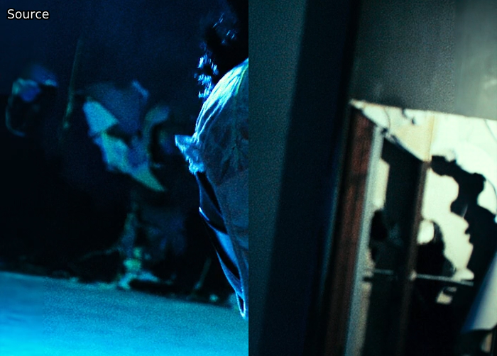
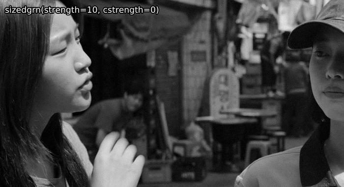
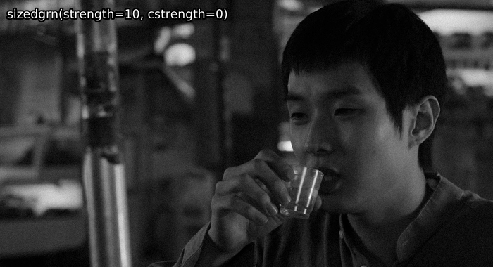
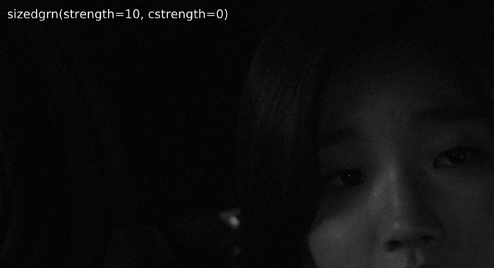

# Graining

TODO: explain why we love grain so much and static vs. dynamic grain.  Also, images.

# Graining Filters

There are a couple different filters you can use to grain.
As lots of functions work similarly, we will only cover AddGrain and libplacebo graining.

## AddGrain

This plugin allows you to add grain to the luma and chroma grains in differing strengths and grain patterns:

```py
grain = src.grain.Add(var=1.0, uvar=0.0, seed=-1, constant=False)
```

Here, `var` controls the grain strength for the luma plane, and `uvar` controls the strength for the chroma plane.
`seed` allows you to specify a custom grain pattern, which is useful if you'd like to reproduce a grain pattern multiple times, e.g. for comparing encodes.
`constant` allows you to choose between static and dynamic grain.

Raising the strength increases both the amount of grain added as well as the offset a grained pixel will have from the original pixel.
For example, `var=1` will lead to values being up to 3 8-bit steps away from the input values.

There's no real point in using this function directly, but it's good to know what it does, as it's considered the go-to grainer.

<details>
<summary>In-depth function explanation</summary>
This plugin uses a normal distribution to find the values it changes the input by.
The `var` parameter is the standard deviation (usually noted as \(\sigma\)) of the normal distribution.

This means that (these are approximations):
* \\(68.27\\%\\) of output pixel values are within \\(\pm1\times\mathtt{var}\\) of the input value
* \\(95.45\\%\\) of output pixel values are within \\(\pm2\times\mathtt{var}\\) of the input value
* \\(99.73\\%\\) of output pixel values are within \\(\pm3\times\mathtt{var}\\) of the input value
* \\(50\\%\\) of output pixel values are within \\(\pm0.675\times\mathtt{var}\\) of the input value
* \\(90\\%\\) of output pixel values are within \\(\pm1.645\times\mathtt{var}\\) of the input value
* \\(95\\%\\) of output pixel values are within \\(\pm1.960\times\mathtt{var}\\) of the input value
* \\(99\\%\\) of output pixel values are within \\(\pm2.576\times\mathtt{var}\\) of the input value
</details>

## placebo.Deband as a grainer

Alternatively, using `placebo.Deband` solely as a grainer can also lead to some nice results:

```py
grain = placebo.Deband(iterations=0, grain=6.0)
```

The main advantage here is it runs on your GPU, so if your GPU isn't already busy with other filters, using this can get you a slight speed-up.

<details>
<summary>In-depth function explanation</summary>
TODO
</details>

## adaptive_grain

This function from [`kagefunc`](https://github.com/Irrational-Encoding-Wizardry/kagefunc) applies AddGrain according to overall frame brightness and individual pixel brightness.
This is very useful for covering up minor banding and/or helping x264 distribute more bits to darks.

```py
grain = kgf.adaptive_grain(src, strength=.25, static=True, luma_scaling=12, show_mask=False)
```

`strength` here is `var` from AddGrain.
The default or slightly lower is usually fine.
You likely don't want to go above 0.75.

The `luma_scaling` parameter is used to control how strong it should favor darker frames over brighter frames, whereby lower `luma_scaling` will apply more grain to bright frames.
You can use extremely low or extremely high values here depending on what you want.
For example, if you want to grain all frames significantly, you might use `luma_scaling=5`, while if you just want to apply grain to darker parts of darker frames to cover up minor banding, you might use `luma_scaling=100`.

`show_mask` shows you the mask that's used to apply the grain, with whiter meaning more grain is applied.
It's recommended to switch this on when tuning `luma_scaling`.

<details>
<summary>In-depth function explanation</summary>
The author of the function wrote a <a href="https://blog.kageru.moe/legacy/adaptivegrain.html">fantastic blog post explaining the function and how it works</a>.
</details>

## GrainFactory3

TODO: rewrite this or just remove it.

An older alternative to `kgf.adaptive_grain`, [`havsfunc`](https://github.com/HomeOfVapourSynthEvolution/havsfunc)'s `GrainFactory3` is still quite interesting.
It splits pixel values into four groups based on their brightness and applies differently sized grain at different strengths via AddGrain to these groups.

```py
grain = haf.GrainFactory3(src, g1str=7.0, g2str=5.0, g3str=3.0, g1shrp=60, g2shrp=66, g3shrp=80, g1size=1.5, g2size=1.2, g3size=0.9, temp_avg=0, ontop_grain=0.0, th1=24, th2=56, th3=128, th4=160)
```

The parameters are explained [above the source code](https://github.com/HomeOfVapourSynthEvolution/havsfunc/blob/master/havsfunc.py#L3720).

This function is mainly useful if you want to apply grain to specific frames only, as overall frame brightness should be taken into account if grain is applied to the whole video.

For example, `GrainFactory3` to make up for missing grain on left and right borders:

<p align="center"> 

</p>

<details>
<summary>In-depth function explanation</summary>
TODO

In short: Create a mask for each brightness group, use bicubic resizing with sharpness controlling b and c to resize the grain, then apply that.
Temporal averaging just averages the grain for the current frame and its direct neighbors using misc.AverageFrames.
</details>

## adptvgrnMod

This function resizes grain in the same way `GrainFactory3` does, then applies it using the method from `adaptive_grain`.
It also has some protection for darks and brights to maintain average frame brightness:

```py
grain = agm.adptvgrnMod(strength=0.25, cstrength=None, size=1, sharp=50, static=False, luma_scaling=12, seed=-1, show_mask=False)
```

Grain strength is controlled by `strength` for luma and `cstrength` for chroma.
`cstrength` defaults to half of `strength`.
Just like `adaptive_grain`, the default or slightly lower is usually fine, but you shouldn't go too high.
If you're using a `size` greater than the default, you can get away with higher values, e.g. `strength=1`, but it's still advised to stay conservative with grain application.

The `size` and `sharp` parameters allow you to make the applied grain look a bit more like the rest of the film's.
It's recommended to play around with these so that fake grain isn't too obvious.
In most cases, you will want to raise both of them ever so slightly, e.g. `size=1.2, sharp=60`.

`static`, `luma_scaling`, and `show_mask` are equivalent to `adaptive_grain`, so scroll up for explanations.
`seed` is the same as AddGrain's; again, scroll up.

By default, `adptvgrnMod` will fade grain around extremes (16 or 235) and shades of gray.
These features can be turned off by setting `fade_edges=False` and `protect_neutral=False` respectively.

It's recently become common practice to remove graining entirely from one's debander and grain debanded areas entirely with this function.

### sizedgrn

If one wants to disable the brightness-based application, one can use `sizedgrn`, which is the internal graining function in `adptvgrnMod`.

<details>
<summary>Some examples of <code>adptvgrnMod</code> compared with <code>sizedgrn</code> for those curious</summary>

A bright scene, where the brightness-based application makes a large difference:

<p align="center"> 

</p>

An overall darker scene, where the difference is a lot smaller:

<p align="center"> 

</p>

A dark scene, where grain is applied evenly (almost) everywhere in the frame:

<p align="center"> 

</p>
</details>

<details>
<summary>In-depth function explanation</summary>
(Old write-up from the function's author.)

### Size and Sharpness

The graining part of adptvgrnMod is the same as GrainFactory3's; it creates a "blank" (midway point of bit depth) clip at a resolution defined by the size parameter, then scales that via a bicubic kernel that uses b and c values determined by sharp:

$$\mathrm{grain\ width} = \mathrm{mod}4 \left( \frac{\mathrm{clip\ width}}{\mathrm{size}} \right)$$

For example, with a 1920x1080 clip and a size value of 1.5:

$$ \mathrm{mod}4 \left( \frac{1920}{1.5} \right) = 1280 $$

This determines the size of the frame the grainer operates on.

Now, the bicubic kernel's parameters are determined:

$$ b = \frac{\mathrm{sharp}}{-50} + 1 $$
$$ c = \frac{1 - b}{2} $$

This means that for the default sharp of 50, a Catmull-Rom filter is used:

$$ b = 0, \qquad c = 0.5 $$

Values under 50 will tend towards B-Spline (b=1, c=0), while ones above 50 will tend towards b=-1, c=1. As such, for a Mitchell (b=1/3, c=1/3) filter, one would require sharp of 100/3.

The grained "blank" clip is then resized to the input clip's resolution with this kernel. If size is greater than 1.5, an additional resizer call is added before the upscale to the input resolution:

$$ \mathrm{pre\ width} = \mathrm{mod}4 \left( \frac{\mathrm{clip\ width} + \mathrm{grain\ width}}{2} \right) $$

With our resolutions so far (assuming we did this for size 1.5), this would be 1600.  This means with size 2, where this preprocessing would actually occur, our grain would go through the following resolutions:

$$ 960 \rightarrow 1440 \rightarrow 1920 $$

### Fade Edges

The fade_edges parameter introduces the option to attempt to maintain overall average image brightness, similar to ideal dithering. It does so by limiting the graining at the edges of the clip's range. This is done via the following expression:
```
x y neutral - abs - low < x y neutral - abs + high > or
x y neutral - x + ?
```

Here, x is the input clip, y is the grained clip, neutral is the midway point from the previously grained clip, and low and high are the edges of the range (e.g. 16 and 235 for 8-bit luma). Converted from postfix to infix notation, this reads:

\\[x = x\ \mathtt{if}\ x - \mathrm{abs}(y - neutral) < low\ \mathtt{or}\ x - \mathrm{abs}(y - neutral) > high\ \mathtt{else}\ x + (y - neutral)\\]

The effect here is that all grain that wouldn't be clipped during output regardless of whether it grains in a positive or negative direction remains, while grain that would pass the plane's limits isn't taken.

In addition to this parameter, protect_neutral is also available. This parameter protects "neutral" chroma (i.e. chroma for shades of gray) from being grained. To do this, it takes advantage of AddGrainC working according to a Guassian distribution, which means that
$$max\ value = 3 \times \sigma$$
(sigma being the standard deviation - the strength or cstrength parameter) is with 99.73% certainty the largest deviated value from the norm (0). This means we can perform a similar operation to the one for fade_edges to keep the midways from being grained. To do this, we resize the input clip to 4:4:4 and use the following expression:

\\[\\begin{align}x \leq (low + max\ value)\ \mathtt{or}\ x \geq (high - max\ value)\ \mathtt{and}\\\\ \mathrm{abs}(y - neutral) \leq max\ value\ \mathtt{and}\ \mathrm{abs}(z - neutral) \leq max\ value \\end{align}\\]

With x, y, z being each of the three planes. If the statement is true, the input clip is returned, else the grained clip is returned.

I originally thought the logic behind protect_neutral would also work well for fade_edges, but I then realized this would completely remove grain near the edges instead of fading it.

Now, the input clip and grained clip (which was merged via std.MergeDiff, which is x - y - neutral) can be merged via the adaptive_grain mask.
</details>
