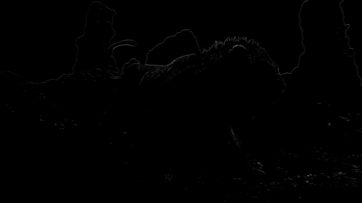

# this needs to be reformatted

Masking is a less straightforward topic. The idea is to limit the
application of filters according to the source image's properties. A
mask will typically be grayscale, whereby how much of the two clips in
question are applied is determined by the mask's brightness. So, if you
do

```py
mask = mask_function(src)
filtered = filter_function(src)
merge = core.std.MaskedMerge(src, filtered, mask)
```

The `filtered` clip will be used for every completely white pixel in
`mask`, and the `src` clip for every black pixel, with in-between values
determining the ratio of which clip is applied. Typically, a mask will
be constructed using one of the following three functions:

-   `std.Binarize`: This simply separates pixels by whether they are
    above or below a threshold and sets them to black or white
    accordingly.

-   `std.Expr`: Known to be a very complicated function. Applies logic
    via reverse Polish notation. If you don't know what this is, read up
    on Wikipedia. Some cool things you can do with this are make some
    pixels brighter while keeping others the same (instead of making
    them dark as you would with `std.Binarize`):
    `std.Expr("x 2000 > x 10 * x ?")`. This would multiply every value
    above 2000 by ten and leave the others be. One nice use case is for
    in between values:
    `std.Expr("x 10000 > x 15000 < and x {} = x 0 = ?".format(2**src.format.bits_per_sample - 1))`.\
    This makes every value between 10 000 and 15 000 the maximum value
    allowed by the bit depth and makes the rest zero, just like how a
    `std.Binarize` mask would. Many other functions can be performed via
    this.

-   `std.Convolution`: In essence, apply a matrix to your pixels. The
    documentation explains it well, so just read that if you don't get
    it. Lots of masks are defined via convolution kernels. You can use
    this to do a whole lot of stuff. For example, if you want to average
    all the values surrounding a pixel, do
    `std.Convolution([1, 1, 1, 1, 0, 1, 1, 1, 1])`. To illustrate, let's
    say you have a pixel with the value \\(\mathbf{1}\\) with the following
    \\(3\times3\\) neighborhood:

    \\[\begin{bmatrix}
    0 & 2 & 4 \\\\
    6 & \mathbf{1} & 8 \\\\
    6 & 4 & 2
    \end{bmatrix}\\]

    Now, let's apply a convolution kernel:

    \\[\begin{bmatrix}
    2 & 1 & 3 \\\\
    1 & 0 & 1 \\\\
    4 & 1 & 5
    \end{bmatrix}\\]

    This will result in the pixel 1 becoming:
    \\[\frac{1}{18} \times (2 \times 0 + 1 \times 2 + 3 \times 4 + 1 \times 6 + 0 \times \mathbf{1} + 1 \times 8 + 4 \times 6 + 1 \times 4 + 5 \times 2) = \frac{74}{18} \approx 4\\]

So, let's say you want to perform what is commonly referred to as a
simple \"luma mask\":

```py
y = core.std.ShufflePlanes(src, 0, vs.GRAY)
mask = core.std.Binarize(y, 5000)
merge = core.std.MaskedMerge(filtered, src, mask)
```

In this case, I'm assuming we're working in 16-bit. What `std.Binarize`
is doing here is making every value under 5000 the lowest and every
value above 5000 the maximum value allowed by our bit depth. This means
that every pixel above 5000 will be copied from the source clip.

Let's try this using a `filtered` clip which has every pixel's value
multiplied by 8:\


Simple binarize masks on luma are very straightforward and often do a
good job of limiting a filter to the desired area, especially as dark
areas are more prone to banding and blocking.

A more sophisticated version of this is `adaptive_grain` from earlier in
this guide. It scales values from black to white based on both the
pixel's luma value compared to the image's average luma value. A more
in-depth explanation can be found on [the creator's blog](https://blog.kageru.moe/legacy/adaptivegrain.html). We
manipulate this mask using a `luma_scaling` parameter. Let's use a very
high value of 500 here:


Alternatively, we can use an `std.Expr` to merge the clips via the
following logic:

    if abs(src - filtered) <= 1000:
        return filtered
    elif abs(src - filtered) >= 30000:
        return src
    else:
        return src + (src - filtered) * (30000 - abs(src - filtered)) / 29000

This is almost the exact algorithm used in `mvsfunc.LimitFilter`, which
`GradFun3` uses to apply its bilateral filter. In VapourSynth, this
would be:

```py
expr = core.std.Expr([src, filtered], "x y - abs 1000 > x y - abs 30000 > x x y - 30000 x y - abs - * 29000 / + x ? y ?")
```


Now, let's move on to the third option: convolutions, or more
interestingly for us, edge masks. Let's say you have a filter that
smudges details in your clip, but you still want to apply it to
detail-free areas. We can use the following convolutions to locate
horizontal and vertical edges in the image:

\\[\begin{aligned}
&\begin{bmatrix}
1 & 0 & -1 \\\\
2 & 0 & -2 \\\\
1 & 0 & -1
\end{bmatrix}
&\begin{bmatrix}
1 & 2 & 1 \\\\
0 & 0 & 0 \\\\
-1 & -2 & -1
\end{bmatrix}\end{aligned}\\]

Combining these two is what is commonly referred to as a Sobel-type edge
mask. It produces the following for our image of the lion:


Now, this result is obviously rather boring. One can see a rough outline
of the background and the top of the lion, but not much more can be made
out.\
To change this, let's introduce some new functions:

-   `std.Maximum/Minimum`: Use this to grow or shrink your mask, you may
    additionally want to apply `coordinates=[0, 1, 2, 3, 4, 5, 6, 7]`
    with whatever numbers work for you in order to specify weights of
    the surrounding pixels.

-   `std.Inflate/Deflate`: Similar to the previous functions, but
    instead of applying the maximum of pixels, it merges them, which
    gets you a slight blur of edges. Useful at the end of most masks so
    you get a slight transition between masked areas.

We can combine these with the `std.Binarize` function from before to get
a nifty output:

```py
mask = y.std.Sobel()
binarize = mask.std.Binarize(3000)
maximum = binarize.std.Maximum().std.Maximum()
inflate = maximum.std.Inflate().std.Inflate().std.Inflate()
```


A common example of a filter that might smudge the output is an
anti-aliasing or a debanding filter. In the case of an anti-aliasing
filter, we apply the filter via the mask to the source, while in the
case of the debander, we apply the source via the mask to the filtered
source:

```py
mask = y.std.Sobel()

aa = taa.TAAmbk(src, aatype=3, mtype=0)
merge = core.std.MaskedMerge(src, aa, mask)

deband = src.f3kdb.Deband()
merge = core.std.MaskedMerge(deband, src, mask)
```

We can also use a different edge mask, namely `kgf.retinex_edgemask`,
which raises contrast in dark areas and creates a second edge mask using
the output of that, then merges it with the edge mask produced using the
untouched image:


This already looks great. Let's manipulate it similarly to before and
see how it affects a destructive deband in the twig area at the bottom:

```py
deband = src.f3kdb.Deband(y=150, cb=150, cr=150, grainy=0, grainc=0)
mask = kgf.retinex_edgemask(src).std.Binarize(8000).std.Maximum()
merge = core.std.MaskedMerge(deband, src, mask)
```


While some details remain smudged, we've successfully recovered a very
noticeable portion of the twigs. Another example of a deband suffering
from detail loss without an edge mask can be found under figure
[35](#fig:18) in the appendix.

Other noteworthy edge masks easily available in VapourSynth include:

-   `std.Prewitt` is similar to Sobel. It's the same operator with the 2
    switched out for a 1.

-   `tcanny.TCanny` is basically a Sobel mask thrown over a blurred
    clip.

-   `kgf.kirsch` will generate almost identical results to
    `retinex_edgemask` in bright scenes, as it's one of its components.
    Slower than the others, as it uses more directions, but will get you
    great results.

Some edge mask comparisons can be found in the appendix under figures
[26](#fig:16){reference-type="ref" reference="fig:16"},
[30](#fig:10){reference-type="ref" reference="fig:10"} and
[34](#fig:23){reference-type="ref" reference="fig:23"}.

As a debanding alternative to edge masks, we can also use \"range\"
masks, which employ `std.Minimum` and `std.Maximum` to locate details.
The most well known example of this is the mask inside `GradFun3`. This
works as follows:

Then, two clips are created, one which will employ `std.Maximum`, while
the other obviously will use `std.Minimum`. These use special
coordinates depending on the `mrad` value given. If
\\(\mathtt{mrad} \mod 3 = 1\\), `[0, 1, 0, 1, 1, 0, 1, 0]` will be used as
coordinates. Otherwise, `[1, 1, 1, 1, 1, 1, 1, 1]` is used. Then, this
process is repeated with \\(\mathtt{mrad} = \mathtt{mrad} - 1\\) until
$\mathtt{mrad} = 0$. This all probably sounds a bit overwhelming, but
it's really just finding the maximum and minimum values for each pixel
neighborhood.

Once these are calculated, the minimized mask is subtracted from the
maximized mask, and the mask is complete. So, let's look at the output
compared to the modified `retinex_edgemask` from earlier:


Here, we get some more pixels picked up by the `GradFun3` mask in the
skies and some brighter flat textures. However, the retinex-type edge
mask prevails in darker, more detailed areas. Computationally, our
detail mask is a lot quicker, however, and it does pick up a lot of what
we want, so it's not a bad choice.

Fortunately for us, this isn't the end of these kinds of masks. There
are two notable masks based on this concept: [`debandmask`](https://pastebin.com/SHQZjVJ5) and
`lvsfunc.denoise.detail_mask`. The former takes our `GradFun3` mask and
binarizes it according to the input luma's brightness. Four parameters
play a role in this process: `lo`, `hi`, `lothr`, and `hithr`. Values
below `lo` are binarized according to `lothr`, values above `hi` are
binarized according to `hithr`, and values in between are binarized
according to a linear scaling between the two thresholds:

\\[\frac{\mathtt{mask} - \mathtt{lo}}{\mathtt{hi} - \mathtt{lo}} \times (\mathtt{hithr} - \mathtt{lothr}) + \mathtt{lothr}\\]

This makes it more useful in our specific scenario, as the mask becomes
stronger in darks compared to `GradFun3`. When playing around with the
parameters, we can e.. lower `lo` so we our very dark areas aren't
affected too badly, lower `lothr` to make it stronger in these darks,
raise `hi` to enlarge our `lo` to `hi` gap, and raise `hithr` to weaken
it in brights. Simple values might be
`lo=22 << 8, lothr=250, hi=48 << 8, hithr=500`:


While not perfect, as this is a tough scene, and parameters might not be
optimal, the difference in darks is obvious, and less banding is picked
up in the background's banding.

Our other option for an altered `GradFun3` is `lvf.denoise.detail_mask`.
This mask combines the previous idea of the `GradFun3` mask with a
Prewitt-type edge mask.

First, two denoised clips are created using `KNLMeansCL`, one with half
the other's denoise strength. The stronger one has a `GradFun3`-type
mask applied, which is then binarized, while the latter has a Prewitt
edge mask applied, which again is binarized. The two are then combined
so the former mask gets any edges it may have missed from the latter
mask.

The output is then put through two calls of `RemoveGrain`, the first one
setting each pixel to the nearest value of its four surrounding pixel
pairs' (e.. top and bottom surrounding pixels make up one pair) highest
and lowest average value. The second call effectively performs the
following convolution: 
\\[\begin{bmatrix}
1 & 2 & 1 \\\\
2 & 4 & 2 \\\\
1 & 2 & 1
\end{bmatrix}\\]

By default, the denoiser is turned off, but this is one of its
advantages for us in this case, as we'd like the sky to have fewer
pixels picked up while we'd prefer more of the rest of the image to be
picked up. To compare, I've used a binarize threshold similar to the one
used in the `debandmask` example. Keep in mind this is a newer mask, so
my inexperience with it might show to those who have played around with
it more:


Although an improvement in some areas, in this case, we aren't quite
getting the step up we would like. Again, better optimized parameters
might have helped.

In case someone wants to play around with the image used here, it's
available in this guide's repository:
<https://git.concertos.live/Encode_Guide/Encode_Guide/src/branch/master/Pictures/lion.png>.

Additionally, the following functions can be of help when masking,
limiting et cetera:

-   `std.MakeDiff` and `std.MergeDiff`: These should be
    self-explanatory. Use cases can be applying something to a degrained
    clip and then merging the clip back, as was elaborated in the
    Denoising section.

-   `std.Transpose`: Transpose (i.. flip) your clip.

-   `std.Turn180`: Turns by 180 degrees.

-   `std.BlankClip`: Just a frame of a solid color. You can use this to
    replace bad backgrounds or for cases where you've added grain to an
    entire movie but you don't want the end credits to be full of grain.
    To maintain TV range, you can use
    `std.BlankClip(src, color=[16, 128, 128]`) for 8-bit black. Also
    useful for making area based masks.

-   `std.Invert`: Self-explanatory. You can also just swap which clip
    gets merged via the mask instead of doing this.

-   `std.Limiter`: You can use this to limit pixels to certain values.
    Useful for maintaining TV range (`std.Limiter(min=16, max=235)`).

-   `std.Median`: This replaces each pixel with the median value in its
    neighborhood. Mostly useless.

-   `std.StackHorizontal`/`std.StackVertical`: Stack clips on top
    of/next to each other.

-   `std.Merge`: This lets you merge two clips with given weights. A
    weight of 0 will return the first clip, while 1 will return the
    second. The first thing you give it is a list of clips, and the
    second item is a list of weights for each plane. Here's how to merge
    chroma from the second clip into luma from the first:
    `std.Merge([first, second], [0, 1])`. If no third value is given,
    the second one is copied for the third plane.

-   `std.ShufflePlanes`: Extract or merge planes from a clip. For
    example, you can get the luma plane with
    `std.ShufflePlanes(src, 0, vs.GRAY)`.

If you want to apply something to only a certain area, you can use the
wrapper [`rekt`](https://gitlab.com/Ututu/rekt) or `rekt_fast`. The latter only applies you function
to the given area, which speeds it up and is quite useful for
anti-aliasing and similar slow filters. Some wrappers around this exist
already, like `rektaa` for anti-aliasing. Functions in `rekt_fast` are
applied via a lambda function, so instead of `src.f3kdb.Deband()`, you
input `rekt_fast(src, lambda x: x.f3kdb.Deband())`.

One more very special function is `std.FrameEval`. What this allows you
to do is evaluate every frame of a clip and apply a frame-specific
function. This is quite confusing, but there are some nice examples in
VapourSynth's documentation:
<http://www.vapoursynth.com/doc/functions/frameeval.html>. Now, unless
you're interested in writing a function that requires this, you likely
won't ever use it. However, many functions use it, including\
`kgf.adaptive_grain`, `awf.FrameInfo`, `fvf.AutoDeblock`, `TAAmbk`, and
many more. One example I can think of to showcase this is applying a
different debander depending on frame type:

```py
import functools
def FrameTypeDeband(n, f, clip):
    if clip.props['_PictType'].decode() == "B":
        return core.f3kdb.Deband(clip, y=64, cr=0, cb=0, grainy=64, grainc=0, keep_tv_range=True, dynamic_grain=False)
    elif clip.props['_PictType'].decode() == "P":
        return core.f3kdb.Deband(clip, y=48, cr=0, cb=0, grainy=64, grainc=0, keep_tv_range=True, dynamic_grain=False)
    else:
        return core.f3kdb.Deband(clip, y=32, cr=0, cb=0, grainy=64, grainc=0, keep_tv_range=True, dynamic_grain=False)
        
out = core.std.FrameEval(src, functools.partial(FrameTypeDeband, clip=src), src)
```

If you'd like to learn more, I'd suggest reading through the Irrational
Encoding Wizardry GitHub group's guide:
<https://guide.encode.moe/encoding/masking-limiting-etc.html> and
reading through most of your favorite Python functions for VapourSynth.
Pretty much all of the good ones should use some mask or have developed
their own mask for their specific use case.
