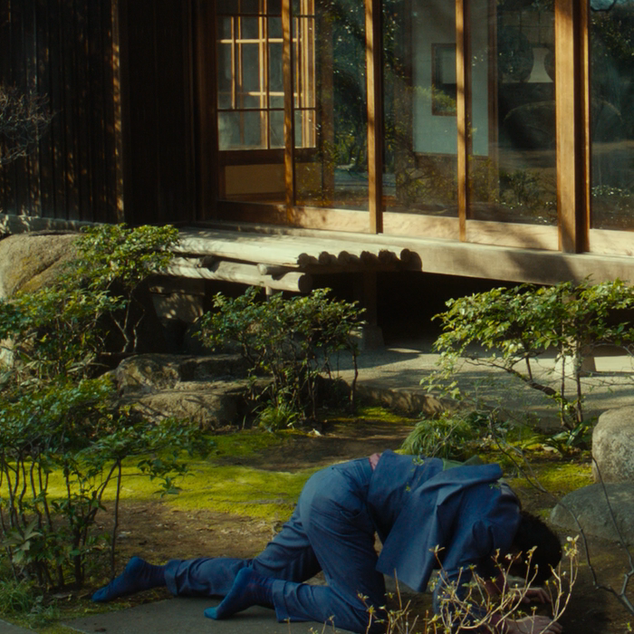
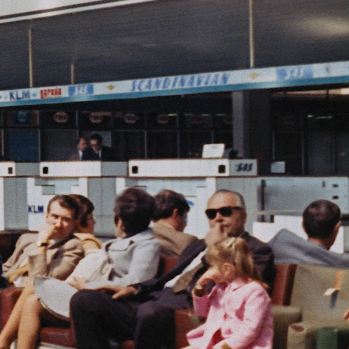

调整大小(Resizing)是一个非常复杂的话题。
然而，对于简单的downscaled压制，人们不需要知道太多信息。
因此，此页面将仅涵盖必要的downscaling说明。
那些有兴趣了解有关重采样的更多信息的人应该参考 [Irrational Encoding Wizardry's guide's resampling page](https://guide.encode.moe/encoding/resampling.html) 以获取更多信息。

并且您可以查看后面的子章节以了解一些更高级的主题， 例如 [解放缩(descaling)与重新缩放(rescaling)](descaling.md) 或 [色度重新采样(chroma resampling)和移动(shifting)](chroma_res.md)，这两者都是压制动画时绝对需要了解的。

# Downscaling

对于downscaling, 首选的调整器是 spline36 调整器:

```py
resize = src.resize.Spline36(1280, 720, dither_type="error_diffusion")
```

这里的参数应该很简单：只需根据需要调整宽度和高度。
不要担心 `dither_type="error_diffusion"`，只需保持原样即可；它所做的只是让输出看起来更漂亮。
该参数的解释可以在 [抖动(dithering)](bit_depths.md) 章节中找到。

## 寻找目标尺寸

对于 16:9 内容，标准分辨率所需的尺寸应该是众所周知的： \\(3840\times2160\\) 是 2160p, \\(1920\times1080\\) 是 1080p, \\(1280\times720\\) 是 720p.

但是，大多数电影不是以这种纵横比制作的。
更常见的纵横比是 2.39:1，其中视频是 \\(2048\times858\\).
消费类产品通常采用上述分辨率，因此在裁剪黑条后更有可能看到 \\(1920\times804\\) 这种尺寸。

由此我们可以推算720p下的尺寸是 \\(1280\times536\\):

\\[\begin{align}
w &= \frac{720}{1080}\times1920=1280 \\\\
h &= \frac{720}{1080}\times804 =536
\end{align}
\\]

然而，情况并非总是如此。
假设您的视频源是 \\(1920\times806\\):

\\[\begin{align}
w &= \frac{720}{1080}\times1920=1280 \\\\
h &= \frac{720}{1080}\times806 =537.\overline{3}
\end{align}
\\]

显然，我们不能调整大小至 \\(537.\overline{3}\\)，因此我们需要找到具有最低纵横比误差的最接近的高度。
这里的解决方法是除以二，取整，然后再乘以二：

\\[
h = \mathrm{round}\left( \frac{720}{1080} \times 806 \times \frac{1}{2} \right) \times 2 = 538
\\]

在 Python 中：

```py
height = round(1280 / src.width / 2 * src.height) * 2
```

现在，我们将其提供给我们的resize：

```py
resize = src.resize.Spline36(1280, height, dither_type="error_diffusion")
```

或者，如果我们的源被裁剪在左侧和右侧而不是顶部和底部，我们会这样做：

```py
width = round(720 / src.height / 2 * src.width) * 2
```

如果您不想为此烦恼， 您可以使用 [`awsmfunc`](https://github.com/OpusGang/awsmfunc/) 里封装好的 `zresize` 方法:

```py
resize = awf.zresize(src, preset=720)
```

有了这个 `preset` 选项，您不必费心计算任何事情，只需说明目标分辨率（高度），它就会为您确定正确的尺寸。

## 笔记

如果调整不均匀源的大小， 请参阅 [脏线(dirty lines)](dirty_lines.md) 章节， 特别是 [填充边框(FillBorders)](dirty_lines.md#fillborders) 部分和 [笔记](dirty_lines.md#笔记).

此外，值得注意的是，不应在脚本开始时调整大小，因为这样做会损坏执行的某些filtering，甚至重新引入问题。

# 理想的分辨率

对于动漫作品，请参阅 [descaling subchapter](descaling.md) 。
实拍场景中极少需要进行descaling，但如果您的来源特别模糊且明显是廉价制作，则值得研究。

众所周知，并非每个源都应以源的分辨率进行压制。
因此，人们应该知道来源是否有保证，例如从细节保留的角度来看，1080p 压制或 720p 压制就足够了。

为此，我们只需要先将源缩小再放大后进行简单比较：

```py
downscale = src.resize.Spline36(1280, 720, dither_type="error_diffusion")
rescale = downscale.resize.Spline36(src.width, src.height, dither_type="error_diffusion")
```

现在，我们将两者交错，然后通过视频查看细节是否模糊：

```py
out = core.std.Interleave([src, rescale])
```

我们还可以使用 `awsmfunc` 里封装的所有关于 `UpscaleCheck` 的方法:

```py
out = awf.UpscaleCheck(src)
```

让我们看两个例子。
第一个，Shinjuku Swan II:

<p align="center">

</p>

在这里，边缘在重新调整后变得非常模糊，这意味着 1080p 是有保证的。
这在植物的叶子中尤为明显。

第二个，The Way of the Dragon:

<p align="center">

</p>

在这里，我们看到颗粒非常轻微地模糊，并且一些压缩产物被扭曲了。
但是，边缘和细节不受影响，这意味着 720p 在这里就可以了。
